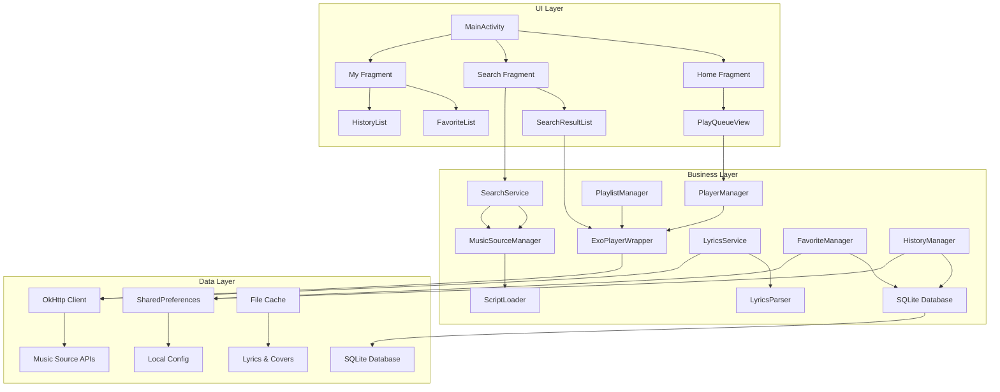

# LX Music Player

Feature Name: lx-music-player  
Updated: 2026-05-27

## Description

本项目是一个 Android 平台原生音乐播放软件，支持导入自定义音乐源脚本（类似洛雪音乐格式），集成 ExoPlayer 播放器。提供 Material Design 3 美观界面，支持多平台音乐聚合搜索、在线播放、歌词同步显示、收藏和历史记录功能。

## Architecture



### 架构说明

1. **UI Layer（UI 层）**: 负责界面展示和用户交互
   - 使用 Material Design 3 组件库
   - Fragment + ViewModel 架构
   - LiveData/StateFlow 响应式更新

2. **Business Layer（业务层）**: 核心业务逻辑
   - MusicSourceManager: 音乐源脚本管理
   - SearchService: 聚合搜索服务
   - PlayerManager: 播放器管理器
   - LyricsService: 歌词加载和解析
   - FavoriteManager: 收藏管理
   - HistoryManager: 历史记录管理
   - PlaylistManager: 播放队列管理

3. **Data Layer（数据层）**: 数据持久化和网络请求
   - OkHttp: 网络请求
   - SharedPreferences: 本地配置
   - SQLite: 结构化数据存储
   - File Cache: 歌词和封面缓存

## Components and Interfaces

### 1. MusicSourceManager

**职责**: 管理音乐源脚本，提供搜索和播放链接 API

```java
public class MusicSourceManager {
    public interface SourceCallback<T> {
        void onSuccess(T result);
        void onError(String error);
    }
    
    public void importSource(String url, SourceCallback<Boolean> callback);
    public void importSource(File scriptFile, SourceCallback<Boolean> callback);
    public List<MusicSource> getAllSources();
    public void enableSource(String sourceId, boolean enable);
    public SearchResult search(String keyword, List<String> sourceIds, SourceCallback<SearchResult> callback);
    public void getPlayUrl(SongInfo song, SourceCallback<PlayUrl> callback);
    public void getLyrics(SongInfo song, SourceCallback<LyricsInfo> callback);
}
```

### 2. ScriptLoader

**职责**: 加载和执行 JavaScript 音乐源脚本（使用 QuickJS 或 Rhino）

```java
public class ScriptLoader {
    public interface ScriptLoadCallback {
        void onLoaded(MusicSource source);
        void onError(String error);
    }
    
    public void loadFromUrl(String url, ScriptLoadCallback callback);
    public void loadFromFile(File file, ScriptLoadCallback callback);
    public void validateScript(String scriptContent, SourceCallback<Boolean> callback);
    
    private native void initJsEngine();
    private native String executeScript(String script, String functionName, String... args);
}
```

### 3. PlayerManager

**职责**: 管理 ExoPlayer 实例，提供统一播放接口

```java
public class PlayerManager {
    private ExoPlayer player;
    
    public void init(Context context);
    public void setSurface(Surface surface);
    public void play(String url, SongInfo song);
    public void pause();
    public void resume();
    public void stop();
    public void seekTo(long position);
    public long getCurrentPosition();
    public long getDuration();
    public boolean isPlaying();
    public void release();
    
    public void setPlaybackMode(@PlaybackMode int mode);
    public void addToQueue(SongInfo song);
    public void removeFromQueue(String songId);
    public void playNext();
    public void playPrevious();
    
    public void addPlayerListener(PlayerListener listener);
    
    public interface PlayerListener {
        void onSongChange(SongInfo song);
        void onPlayStateChanged(int state);
        void onProgressUpdate(long position, long duration);
        void onError(String error);
    }
}
```

### 4. LyricsService

**职责**: 加载和解析歌词

```java
public class LyricsService {
    public interface LyricsCallback {
        void onLoaded(LyricsInfo lyrics);
        void onError(String error);
    }
    
    public void getLyrics(SongInfo song, MusicSourceManager sourceManager, LyricsCallback callback);
    public LyricsInfo parseLrc(String lrcContent);
    public String getLyricsAtTime(LyricsInfo lyrics, long time);
    public List<LyricsLine> getSyncedLyrics(LyricsInfo lyrics);
}
```

### 5. LyricsParser

**职责**: 解析 LRC 格式歌词

```java
public class LyricsParser {
    public static LyricsInfo parse(String lrc) {
        // 解析 LRC 格式
        // 返回带时间戳的歌词行列表
    }
    
    public static class LyricsInfo {
        public String title;
        public String artist;
        public String album;
        public List<LyricsLine> lines;
    }
    
    public static class LyricsLine {
        public long time;      // 时间戳（毫秒）
        public String content; // 歌词内容
    }
}
```

### 6. SearchService

**职责**: 聚合多个音乐源进行搜索

```java
public class SearchService {
    public interface SearchCallback {
        void onProgress(String sourceName, List<SongInfo> results);
        void onComplete(SearchResult result);
        void onError(String error);
    }
    
    public void search(String keyword, List<String> sourceIds, SearchCallback callback);
    
    public static class SearchResult {
        public List<SongInfo> songs;
        public Map<String, Integer> sourceStats; // 各平台结果数量
        public long totalTime; // 搜索耗时
    }
}
```

### 7. FavoriteManager

**职责**: 管理收藏夹

```java
public class FavoriteManager {
    public boolean addToFavorite(SongInfo song);
    public boolean removeFromFavorite(String songId);
    public boolean isFavorite(String songId);
    public List<SongInfo> getAllFavorites(int page, int pageSize);
    public int getTotalCount();
    public void importFavorites(File jsonFile, SourceCallback<Integer> callback);
    public void exportFavorites(File outputFile, SourceCallback<Boolean> callback);
}
```

### 8. HistoryManager

**职责**: 管理播放历史

```java
public class HistoryManager {
    public void addHistory(SongInfo song);
    public List<SongInfo> getHistory(int limit);
    public void removeHistory(String songId);
    public void clearHistory();
    public void incrementPlayCount(String songId);
}
```

### 9. PlaylistManager

**职责**: 管理播放队列

```java
public class PlaylistManager {
    public enum PlaybackMode {
        REPEAT_SINGLE,   // 单曲循环
        REPEAT_ALL,     // 列表循环
        SHUFFLE        // 随机播放
    }
    
    public void addToQueue(SongInfo song);
    public void removeFromQueue(int position);
    public void clearQueue();
    public List<SongInfo> getQueue();
    public int getCurrentPosition();
    public SongInfo getCurrentSong();
    public void setPlaybackMode(@PlaybackMode int mode);
    public int getPlaybackMode();
    public SongInfo getNextSong();
    public SongInfo getPreviousSong();
}
```

## Data Models

### MusicSource

```java
public class MusicSource {
    private String id;           // 源唯一标识
    private String name;         // 源名称
    private String version;      // 脚本版本
    private String scriptUrl;    // 脚本 URL
    private List<String> platforms; // 支持的平台列表
    private boolean enabled;     // 是否启用
    private long updateTime;     // 更新时间戳
    
    // 脚本 API 定义
    public interface ScriptApi {
        SearchResult search(String keyword);
        PlayUrl getPlayUrl(String songId);
        String getLyrics(String songId);
    }
}
```

### SongInfo

```java
public class SongInfo {
    private String id;           // 歌曲 ID
    private String title;        // 歌曲名
    private String artist;       // 歌手
    private String album;        // 专辑
    private String platform;     // 来源平台
    private String sourceId;     // 音乐源 ID
    private long duration;       // 时长（毫秒）
    private String coverUrl;     // 封面图片 URL
    private int quality;         // 音质：0=标准，1=高质量，2=无损
    private long addTime;        // 添加时间戳
}
```

### PlayUrl

```java
public class PlayUrl {
    private String url;          // 播放地址
    private int quality;         // 音质
    private String format;       // 格式：mp3, flac, aac
    private long size;           // 文件大小（字节）
    private boolean vip;         // 是否需要 VIP
}
```

### LyricsInfo

```java
public class LyricsInfo {
    private String title;        // 歌曲名
    private String artist;       // 歌手
    private String album;        // 专辑
    private List<LyricsLine> lines; // 歌词行列表
    
    public static class LyricsLine {
        public long time;        // 时间戳（毫秒）
        public String content;   // 歌词内容
    }
}
```

## Database Schema

### 收藏表 (favorites)

```sql
CREATE TABLE IF NOT EXISTS favorites (
    id TEXT PRIMARY KEY,
    title TEXT NOT NULL,
    artist TEXT,
    album TEXT,
    platform TEXT,
    source_id TEXT,
    duration INTEGER DEFAULT 0,
    cover_url TEXT,
    add_time INTEGER NOT NULL
);

CREATE INDEX idx_add_time ON favorites(add_time DESC);
```

### 历史表 (history)

```sql
CREATE TABLE IF NOT EXISTS history (
    id TEXT PRIMARY KEY,
    title TEXT NOT NULL,
    artist TEXT,
    album TEXT,
    platform TEXT,
    source_id TEXT,
    duration INTEGER DEFAULT 0,
    play_count INTEGER DEFAULT 1,
    last_play_time INTEGER NOT NULL
);

CREATE INDEX idx_last_play ON history(last_play_time DESC);
```

### 音乐源表 (music_sources)

```sql
CREATE TABLE IF NOT EXISTS music_sources (
    id TEXT PRIMARY KEY,
    name TEXT NOT NULL,
    version TEXT,
    script_url TEXT,
    platforms TEXT, -- JSON 数组
    enabled INTEGER DEFAULT 1,
    update_time INTEGER NOT NULL
);
```

## Music Source Script Format (JS)

```javascript
// 音乐源脚本模板
module.exports = {
    // 源信息
    info: {
        name: "六音音源",
        version: "1.0.7",
        platforms: ["netease", "qq", "kugou", "kuwo"]
    },
    
    // 搜索函数
    search: function(keyword) {
        // 返回搜索结果
        return {
            code: 0, // 0=成功
            msg: "",
            data: {
                songs: [
                    {
                        id: "song_id",
                        title: "歌曲名",
                        artist: "歌手",
                        album: "专辑",
                        duration: 240000,
                        cover: "封面 URL"
                    }
                ]
            }
        };
    },
    
    // 获取播放链接
    getPlayUrl: function(songId) {
        return {
            code: 0,
            msg: "",
            data: {
                url: "播放 URL",
                quality: 1, // 0=标准，1=高质量，2=无损
                format: "mp3"
            }
        };
    },
    
    // 获取歌词
    getLyrics: function(songId) {
        return {
            code: 0,
            msg: "",
            data: {
                lrc: "[00:00.00] 歌词内容\n[00:05.00] 第二行"
            }
        };
    }
};
```

## Correctness Properties

### 播放器状态不变性

1. 播放器在 release() 后不能再次使用
2. play() 必须在 init() 之后调用
3. 同一时间只能有一个播放实例处于 active 状态

### 数据一致性

1. 收藏夹中不能有重复歌曲 ID
2. 播放进度不能超过歌曲总时长
3. 搜索结果的平台必须存在于已启用的音乐源中

### 脚本沙箱安全

1. 脚本不能访问 Android 系统 API
2. 脚本不能访问文件系统
3. 脚本网络请求必须通过应用代理

## Error Handling

### 网络错误

```java
try {
    Response response = client.newCall(request).execute();
    if (!response.isSuccessful()) {
        throw new IOException("HTTP error: " + response.code());
    }
} catch (IOException e) {
    callback.onError("网络连接失败，请检查网络设置");
}
```

### 脚本执行错误

```java
try {
    Object result = jsEngine.callFunction("search", keyword);
} catch (ScriptException e) {
    callback.onError("音乐源脚本执行失败：" + e.getMessage());
}
```

### 播放器错误

```java
player.addListener(new Player.Listener() {
    @Override
    public void onPlaybackException(PlaybackException e) {
        // 自动换源重试
        playerManager.retryWithAlternativeSource();
    }
});
```

### JSON 解析错误

```java
try {
    JSONObject obj = new JSONObject(json);
    // parse...
} catch (JSONException e) {
    callback.onError("数据格式错误");
}
```

## Test Strategy

### 单元测试

1. **LyricsParserTest**: 测试 LRC 歌词解析
2. **SearchServiceTest**: 测试聚合搜索逻辑
3. **FavoriteManagerTest**: 测试收藏、取消收藏功能
4. **HistoryManagerTest**: 测试添加、查询、删除历史记录
5. **PlaylistManagerTest**: 测试播放队列和播放模式

### 集成测试

1. **音乐源导入测试**: 测试从真实 URL 导入脚本
2. **搜索测试**: 测试真实关键词的搜索
3. **播放测试**: 测试真实歌曲 URL 的播放
4. **UI 测试**: 使用 Espresso 测试 UI 交互

### 性能测试

1. **启动时间测试**: 冷启动时间 < 2 秒
2. **内存测试**: 运行时内存占用 < 150MB
3. **搜索响应测试**: 搜索结果返回 < 3 秒

## Tech Stack

- **语言**: Java 17
- **UI 框架**: Material Design 3 Components
- **架构模式**: MVVM + Repository
- **异步处理**: Coroutines + Flow
- **网络库**: OkHttp + Retrofit
- **JSON 库**: Gson / Jackson
- **数据库**: SQLite + Room (可选)
- **播放器**: ExoPlayer 2.19+
- **JS 引擎**: QuickJS (轻量) 或 Rhino (成熟)

## References

[^1]: (ExoPlayer) - [Official Guide](https://exoplayer.dev/)
[^2]: (Material Design 3) - [Material Design Guidelines](https://m3.material.io/)
[^3]: (洛雪音乐) - [GitHub Repository](https://github.com/lyswhut/lx-music-mobile)
[^4]: (QuickJS) - [GitHub Repository](https://github.com/bellard/quickjs)
[^5]: (洛雪音乐源格式) - 自定义 JS 脚本格式
